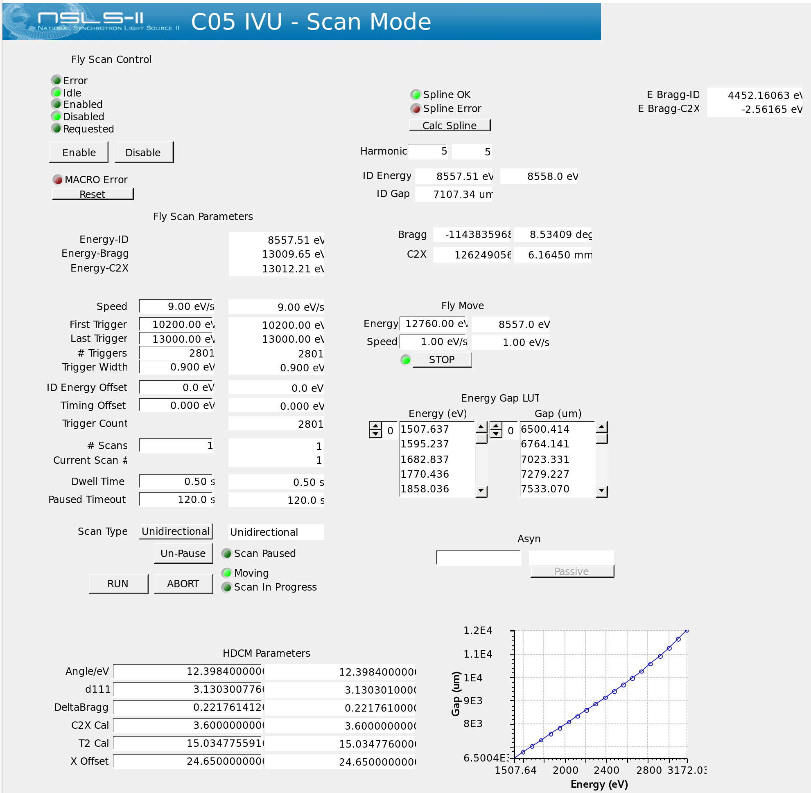
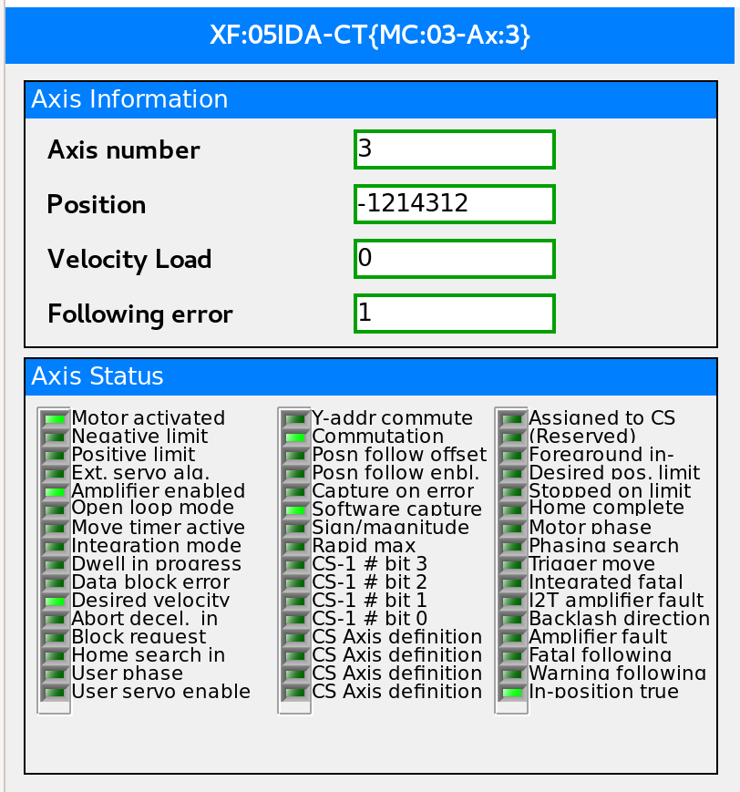
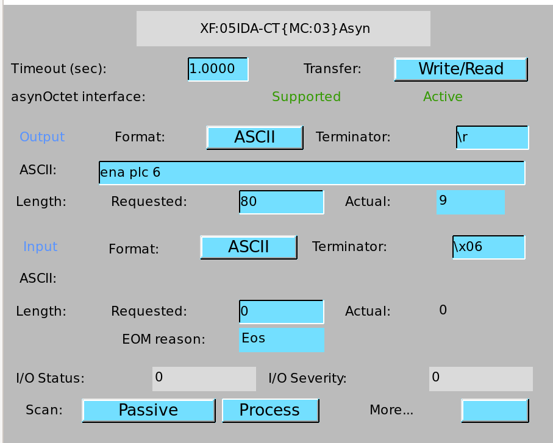

Beamline Staff Pages [staff only]
=================================

The information provided on this page is directed towards helping beamline staff.

Quick Links
-----------
#. `Digital camera web server <http://xf05idd-webcam4.nsls2.bnl.local>`_
#. `Analog camera web server <http://xf05idd-webcam1.nsls2.bnl.local>`_
#. `Ceiling camera web server <http://xf05idd-webcam2.nsls2.bnl.local>`_
#. `Jira ticket system <http://jira.nsls2.bnl.gov>`_
#. `SRX Posted SAFs <https://nsls2bid.bnl.gov/SAF/Index/5-ID>`_
#. `SRX Olog <https://epics-services.nsls2.bnl.gov/srx_logbook/index.html>`_
#. `SRX Radiation Safety Component Checklist <https://ps.bnl.gov/docs/Reference/NSLS-II%20Beamline%205-ID%20Radiation%20Safety%20Component%20Checklist%20TEMPLATE.pdf>`_
#. `NSLS-II Controls Documentation <http://nsls-ii.github.io/>`_
#. `NSLS-II Sharepoint Documentation <https://ps.bnl.gov/phot/ros/Shared%20Documents/MAXIMO%20Development/Beamlines/LT-R-XFD-CO-DR-SRX-002_Rev1.xlsx>`_
#. `Former SRX Wiki Staff Page <https://beamline5id.bnl.gov/index.php/Main_Page>`_

.. todo::

  - Add archiver link

Setting up Users
----------------

#. Post SAF to `PASS Admin <http://passadmin.bnl.gov>`_ 
#. Start the experiment using the proposal ID by running the command: ::

    $ start-experiment -p {proposal_id}

#. Perform beamline specific training. `5-ID BST Form <https://brookhavenlab.sharepoint.com/sites/NSLS2Training/Courses/Shared%20Documents/Forms/AllItems.aspx?id=%2Fsites%2FNSLS2Training%2FCourses%2FShared%20Documents%2FBeamline%20BST%20Forms%2FPS%2DBST%2D5%2DID%2Epdf&parent=%2Fsites%2FNSLS2Training%2FCourses%2FShared%20Documents%2FBeamline%20BST%20Forms>`_

Setting up the Scan Report
--------------------------
.. todo::
    - Add instructions

Virtual Machine Information
---------------------------
A properly managed, Windows-based virtual machine is setup at the beamline. The purpose of this machine is to run Windows, vendor-provided software at the beamline. The virtual machine can be pinged in the command line and accessed with `Guacamole <https://remote.nsls2.bnl.gov>`_.

Hostname: ``xf05id2-win1`` |br|
Guacamole Title: "Windows VM 1" |br|
Password: See shared vault in Bitwarden

Tiled Notes
-----------
While in a bluesky session, it is possible to continue using `db` and it's associated commands. This will still use `tiled` as the backend and allow for a familiar interface using `db`. For `tiled` specific usage, the bluesky startup scripts define `c` as a catalog of scans. This can be accessed from the bluesky session.

If logging in from a separate session, the catalog will need to be initialized. For completeness, all steps are shown here. ::

    [akiss@xf05id2-ws2 ~]$ conda activate 2025-2.0-py311-tiled
    (2025-2.0-py311-tiled) [akiss@xf05id2-ws2 ~]$ ipython
    In [1]: from tiled.client import from_profile
    In [2]: c = from_profile("srx")["raw"]

Similar to databroker API, a scan can be accessed using a scan ID ::

    bs_run = c[12345]
    bs_run
    <BlueskyRun {'primary'} scan_id=12345 uid='e8b02669' 2018-03-04 15:15>

The start/stop documents can be displayed using ::

    bs_run.start
    bs_run.stop

This `BlueskyRun` object behaves like a dictionary. To access the data, start adding keys. This display all keys, use ::

    bs_run["primary"]["data"].keys()[:]

The data can then be extracted using ::

    d = bs_run["primary"]["data"]["fluor"][:]

.. todo::
    - Add searching

Fly-Scanning Spectroscopy
-------------------------
Fly-scanning spectroscopy is still in beta. Below is some information on how to use this capability.

In order to have coordinated motion, the IVU Delta Tau will take complete control over the motion for the IVU, HDCM Bragg, and HDCM C2X. When a scan is started, the IVU will request control, and when the scan is complete, the IVU will disable control. If the scan is stopped or aborted, this may not clean up properly so it is important to check that control is disabled before moving components in bluesky or CSS.

CSS-Pages
*********
To get to the IVU Scan Mode page, please navigate from |br| 
5ID Main -> Insertion Device -> 5 SRX -> IVU 21 Operator Page -> Scan Mode

.. _fig-ivu:

   SRX IVU 21 scan mode CSS page.

Fly-scanning XAS Commands
*************************
Run a fly spectroscopy scan. ``num_scans`` is optional. ``scan_type`` can be set to ``uni`` or ``bi`` to determine if the scan will only fly in one direction or both. ::

        Bluesky@SRX [1] RE(fly_multiple_passes(e_start, e_stop, e_width, dwell, num_pts,
                               num_scans=1, scan_type='uni'))

Export scan data. ::

        Bluesky@SRX [1] export_flyer_id_mono_data(uid_or_scanid)

Recover the bluesky environment from an aborted scan. ::

        Bluesky@SRX [1] RE(flying_xas_reset())
        
Debugging
*********
If there is a problem with the scan and it is stopped or aborted, bluesky might not recover properly. A function has been put together to try to recover nicely, where it aborts any scans, disables the IVU control, unstages the flyer, and resets the scaler. If this does not recover the bluesky environment, then bluesky will need to be quit and restarted. The function to recover the environment is ::

    RE(flying_xas_reset())

If the HDCM Bragg or C2X motors are not moving, it is good to check if the IVU scan mode is enabled. If the scan mode is enabled and a move is tried from CSS or bluesky, the motor can be put into an alarm state with a following error. On one of the motor pages, such as the SRX Align page, you can see a red box around the motor in alarm. To confirm a following error, you can go from |br|
5ID Main -> HDCM -> <motor> More -> PMAC Axis Status

.. _fig-axis:

   SRX HDCM Bragg axis page.

To reset the amplifier fault, go to the asyn page to send commands to the motor controller. |br|
5ID Main -> HDCM -> <motor> More -> Asyn -> More -> Asyn Octet Interface I/O

.. _fig-asyn:

   SRX HDCM Bragg asyn page.

Check that the IVU control is disabled. Type the following command on the motor's asyn page and hit Enter::

        ena plc 6

After executing the command, the alarm will clear after moving the motor.

Beamline Setup
--------------
These tasks are typically done once a cycle.

.. todo::

   * Beamline alignment
   * Setting up the Merlin
   * Setting up the Dexela
   * Setting up the Xspress3

Preparing for a new cycle
*************************

This is a comprehensive list of things to consider before the start of a cycle.

    - Close all system safety work permits.
    - Check cryocooler pressure and load.
    - Check all vacuum, temperature, water systems.
    - Check and top-off the PPS burn-through.
    - Confirm the RGA in the A-hutch is connected and scanning.
    - Perform a Radiation Safety Component Checklist.
    - Post a valid SAF and ESR.
    - Test and deploy the latest bluesky environment.

Aligning the Beamline
*********************
Historically, the beamline and storage ring take about a day to stabilize. Therefore, on day 1 of operations, it makes sense to open the front-end shutter and get light through the monochromator. Since components will drift, optimization should take place on day 2 and after a local bump is performed.
    #. Previous motor positions should be captured at the end of each cycle. As a precaution, capture the current motor positions.
    #. Check front-end (FE) slits, white-beam (WB) slits, and mirror (HFM) position.
        * Open the gap of the undulator to 18 000 μm. Insert the camera in the HFM tank.
        * Open the FE shutter. Open the WB slits all the way (4 mm x 4 mm). Turn off mirror pitch feedback and reset the voltage to 30 V. Remove the HFM by dropping the pitch to 0.0 mrad and translating in the positive direction by 3 mm.
        * Tweak the FE slits so the slits are just protecting the mask.
        * Tweak the WB slits so the slits are centered. Return the WB slit gaps to their previous values (0.5 mm V x 2.0 mm H).
        * Bring the HFM back in. Center the mirror on the incoming beam and confirm the mirror is parallel to the beam. Pitch to the nominal 2.5 mrad. Enable the mirror pitch feedback.
        * Close the FE shutter and retract the camera. 
    #. Align the monochromator to allow light through.
        * With the FE shutter closed, insert the BPM 1 camera (*this can be slow*).
        * In bluesky, set the energy to the last used value. If starting from scratch, choose a higher energy such as 12 keV. By using bluesky, this will set the undulator gap, and monochomator positions to a reasonably close value.
        * Open the pink-beam (PB) slits to a 4.0 mm gap to make sure they are fully open.
        * Open the FE shutter and hopefully light will come through onto the camera.
        * If not, set the exposure time on the camera to something large, like 0.1 s. This will help you see the light come through while you scan the motors. There are 4 motors that can be off: Bragg, crystal offset, roll, and pitch. Hopefully, by starting with Bragg you can start to see some light and then optimize by tweaking pitch and roll. Finally, the position of the beam can be translated with the crystal offset.
        * The PB slits can be centered and closed so they are just intercepting the beam.
        * Once the light is through the monochromator, the FE shutter can be closed, the camera removed, and alignment downstream can continue.
    #. Tweak monochromator and mirror alignment to center secondary source aperture (SSA).

Focusing the K-B Mirrors
************************
These are the complete instructions for focusing the K-B mirrors. Some steps can be skipped if the optics are already aligned and the goal is to tweak the optics.
    #. Check that the local bump is at the nominal values.
    #. Remove the pinhole aperture out of the beam path. Move to Y maximum.
    #. Open the slits: JJ Slits (2.0 x 2.0 mm), SSA (0.050 x 1.0 mm) (HxV).
    #. Move the K-B mirrors out of the beam. They should return to 0 pitch and translate out of the beam path.
    #. Make sure the X-ray beam goes through the system. Check the X-ray eye. The ion chambers should see X-rays. The X-rays should pass through the nanoKB chamber. The X-ray beam should be about 1.5 x 1.2 mm (HxV) on the Merlin detector. Be sure to keep the total counts below 100 kcps.
    #. Check that the JJ slits are centered on the X-ray beam. Close down the JJ slits to 0.3 x 0.6 mm (HxV).
    #. Move in and roughly align the K-B mirrors:
        * Start with the fine pitch motors for both K-B mirrors at 15 μm (the middle of their range).
        * Move in the vertical mirror. Check that the mirror is flat and set to zero. Move to the middle of the X-ray beam.
        * Move in the horizontal mirror. Check that the mirror is flat and set to zero. Move to middle of the X-ray beam.
        * Pitch the vertical mirror to 3 mrad. Translate the mirror down by 0.63 mm.
        * Pitch the horizontal mirror to 3 mrad. Translate the mirror outboard by 0.15 mm.
        * Check that the focused beam can be seen by the Merlin and the VLM is not blocking the focused beam.
    #. Put in the diving board. Look for the fiducial marker patterns (Pt/Cr, 50 nm thick) with 5 μm wide horizontal and vertical features on the very edge.
    #. Use the VLM and fluorescence signal to roughly align the X-ray position cross-hair.
    #. Start with the vertical focus alignment:
        * Run a knife-edge scan across a line to get an initial beam size. ``RE(knife_edge(nano_stage.sy, -10, 10, 0.1, 0.05))``
        * If the beam size is greater than 1 μm, move the coarse Z by 500 μm and look for a smaller beam size. Be aware line features will move horizontally when changing coarse Z.
        * Repeat until the beam size is smaller than 1 μm.
        * Run the slit-scan script. Here we as scanning the sample from -8 to 8 μm to move across the Pt line. The JJ slits are set to a gap of 0.1 mm and scanned a total of 1 mm centered around the beam center. Some of the knife-edge scans will not hit the mirror, so these scans will need to be excluded from the final analysis. ``RE(focusKB('ver'))``
        * The slit-scan script will perform a calculation with ``orthogonality=False`` and ignoring the first two and last two scans. If further adjustment is needed, you can manually run the ``slit_nanoflyscan_cal`` function.
        * The script will show a plot of the Pt line center and report some values. In particular, pay attention to the defocus amount. Move the sample by the defocus amount using the coarse Z stage.
        * Run another knife-edge scan to make sure the focus improved.
        * Run the slit-scan script and calculation again. Hopefully upon calculation, the defocus amount is small (< 100 μm) and the curve is relatively flat. In that case, change the orthogonality flag to True and run the calculation again. Otherwise, repeat until the defocus amount is small.
        * With orthogonality True, the fine vertical pitch is adjusted. Move the fine pitch actuator for the vertical pitch. Move the coarse Z stage as well.
        * Run a knife-edge scan to check the focus improved.
        * Repeat the slit-scan and knife-edge scans with orthogonality True until the focus is acceptable.
    #. Focus the horizontal K-B mirror

        .. warning::
           For horizontal mirror alignment, only horizontal mirror pitch should be moved to prevent astigmatism in the two focal planes.

        * Find a line for scanning and run a knife-edge scan to get the initial beam size. ``RE(knife_edge(nano_stage.sx, -10, 10, 0.1, 0.05))``

        * Run the slit-scan to scan the JJ slits across the mirror. ``RE(focusKB('hor'))``
        * Perform the slit-scan calculations with ``orthogonality=False``
        * The calculation will output an amount to move the horizontal K-B mirror in mrad. Move the horizontal fine pitch actuator by this amount.
        * Similar to the vertical mirror, run a knife-edge scan to make sure the actuator was moved the correct direction and measure the new focus.
        * Repeat the slit-scans until the focus is acceptable.
        * Check the horizontal focus as a function of SSA width.

Calibrating the monochromator
*****************************
*Calibrating the monochromator is done by collecting XANES spectra across several element absorption edges. A least-squares fitting routine will then calculate the HDCM parameters for the calibration*
    #. Collect XANES scans at 4-6 different energies. For the best fit, a wide range of energies is best. Typically, scans are performed using V, Cr, Fe, Cu, Se, Zr, Mo foils. :: 

        Bluesky@SRX [1] X = getbindingE('Fe')
        Bluesky@SRX [2] %mov energy X
        Bluesky@SRX [3] RE(peakup())
        Bluesky@SRX [4] RE(xanes_plan([X-50, X+50], [1], 1.0))

    #. Define a dictionary in bluesky with element symbols mapped to scan IDs. ::

        Bluesky@SRX [5] scanlogDic = {'V' : 1000,
                                      'Cr': 1001,
                                      'Fe': 1002,
                                      'Cu': 1003,
                                      'Se': 1004,
                                      'Zr': 1005,
                                      'Mo': 1006}

    #. Run the ``braggcalib()`` function with the dictionary as input. The function will go through each scan and display a plot marking where the edge was found. Finally, this will output the new HDCM parameters. ::

        Bluesky@SRX [6] braggcalib(scanlogDic=scanlogDic, use_xrf=True)

    #. Update the values in the bluesky profile (``10-machine.py``). Save and restart bluesky.

Updating the IVU LUT
********************
When asked to move to a given X-ray energy, the undulator (IVU) gap must move accordingly to stay on a harmonic. Variations from cycle-to-cycle have been observed so calibrating the lookup-table for the IVU is an important step at the beginning of the cycle.

To generate a new lookup-table, start by installing the Ti foil for BPM4. A scan plan is written to scan across a given harmonic - the default is the third harmonic - at different gaps and export a LUT file. This scan can be run using ::

    Bluesky@SRX [1] undulator_calibration()

This will export a text file of the LUT in the ``xf05id1`` home directory.

If the LUT is satisfactory, the file should be copied into the SRX startup scripts. These are found at ``/home/xf05id1/ipython_ophyd/data``

There is a symlink that points to the current calibration. To update this to point to the new calibration, from a terminal in the ``data`` directory execute the following commands ::

    $ unlink SRXUgapCalibration.txt
    $ ln -s YYYYMMDD_SRXUgapCalibration.txt SRXUgapCalibration.txt

Since bluesky is only looking at the symlink, the new LUT can be loaded by restarting bluesky.

Beamline Maintenance
--------------------
.. todo::
    * Calibrating the Xspress3
    * Power loss preparation and recovery

Cryocooler
**********
*The manual for the cryocooler can be found here.*

.. todo::
    * Add link to cryocooler manual

Warming the cryocooler
^^^^^^^^^^^^^^^^^^^^^^
    #. Connect a turbo-pump station to the monochromator tank. Pump the turbo so that it reads a pressure in the 10\ :sup:`-8` Torr range.
    #. Close the beamline gate valves to isolate the monochromator.
    #. Open the manual valve between the monochromator and turbo-pump.
    #. Turn off the ion pump. This should automatically put the cryocooler in "Stop" mode.
    #. The cryocooler will warm up over several days.

Cooling the cryocooler
^^^^^^^^^^^^^^^^^^^^^^
    #. Verify the monochromator cold cathode gauge is on and the cryocooler is not inhibitted. This typically means a pressure reading better than 10\ :sup:`-7` Torr.
    #. Purge the system according to the cryocooler manual, section 3.3.1, on page 28. *Note: V10 and V11 are variable values, 0% = Close, 100% = Open.*
        * Verify N\ :sub:`2` gas source is at a pressure between 1.5 and 3.0 bar.
        * Verify the monochromator ion pump and cold cathode gauge are on.
        * Close all the valves.
        * Open V9, V10, V20, and V21 fully. Purge for 30 min.
        * Close V9 and open V11. Purge for 15 min.
        * Close V11. Open V17 and purge for 15 min.
        * Close all the valves.
    #. Following the cryocooler manual, section 4.2.1.1, fill the sub-cooler to 15% and fill the heater vessel to 20%.
        * Verify the liquid N\ :sub:`2` source valve is open.
        * Open V19 to start filling the sub-cooler.
        * Close V19 when the sub-cooler reaches 15%.
        * Open heater vessel valve to start filling the heater vessel.
        * Close heater vessel valve when level reaches 20%.
    #. Follow the automatic cool down proceedure from the manual, section 4.3.
        * Verify the liquid N\ :sub:`2` source valve is open.
        * From the cryocooler CSS page, click "Cool Down".
        * Once full, in CSS click on the "A" to enable automatic filling of the cryocooler.

Controls
--------

IOC Monitoring
**************
The ``manage-iocs`` tool can be used to monitor the IOC status. SSH into the server that hosts the IOC (*e.g.* xf05idd-ioc1) and run:
    * List all IOCs ::

        $ manage-iocs report

    * Show IOC status ::

        $ manage-iocs status

    * Start IOC, *softioc-example*. The name of the IOC can be found using ``manage-iocs``. Do not include the "softioc-" in the name. ::

        $ dzdo manage-iocs start exampleIOC

    * Stop IOC, *softioc-example*. The name of the IOC can be found using ``manage-iocs``. Do not include the "softioc-" in the name. ::

        $ dzdo manage-iocs stop exampleIOC

    * You can also ``telnet`` into the IOC using ::

        $ manage-iocs attach exampleIOC
        $ telnet localhost port

    * To exit the telnet, type ``Ctrl+]`` and then ``q``.

 
Motion Controls
***************
.. todo::
    * Insert table with: Motor controller, IOC, Motor, PV, Bluesky object
    * Rearrange table to be motor, bluesky, IOC, controller, PV?
    * List of all IOCs on each server

.. table:: xf05ida-ioc1 motors
   :name: xf05ida-ioc1-motors
   :align: left

   ================ ============ ========= === ==============
   Motor Controller IOC          Motor     PV  Bluesky Object
   ================ ============ ========= === ==============
   mc01             softioc-mc01 testmotor XF: bs.motor
   ================ ============ ========= === ==============

.. table:: xf05idd-ioc1 motors
   :name: xf05idd-ioc1-motors
   :align: left

   ================ ============ ========= === ==============
   Motor Controller IOC          Motor     PV  Bluesky Object
   ================ ============ ========= === ==============
   mc01             softioc-mc01 testmotor XF: bs.motor
   ================ ============ ========= === ==============

.. table:: xf05idd-ioc3 motors
   :name: xf05idd-ioc3-motors
   :align: left

   ==================== ================ ================ ================= ================================== 
   Motor                Bluesky Object   Motor Controller IOC               PV                                 
   ==================== ================ ================ ================= ================================== 
   nanoKBv angle calc   bs.motor         none             softioc-anglecalc XF:05IDD-ES:1{nKB:vert-Ax:PC}Mtr   
   nanoKBh angle calc   bs.motor         none             softioc-anglecalc XF:05IDD-ES:1{nKB:horz-Ax:PC}Mtr   
   testmotor            bs.motor         fpsensor1        softioc-fpsensor  XF:05IDD-ES:1{FPS:1-Chan0}Pos-I    
   testmotor            bs.motor         fpsensor1        softioc-fpsensor  XF:05IDD-ES:1{FPS:1-Chan1}Pos-I    
   testmotor            bs.motor         fpsensor1        softioc-fpsensor  XF:05IDD-ES:1{FPS:1-Chan2}Pos-I    
   nanoKBv Fine Pitch   bs.motor         PI E518          softioc-mcd19     XF:05IDD-ES:1{nKB:vert-Ax:PFPI}Mtr 
   nanoKBh Fine Pitch   bs.motor         PI E518          softioc-mcd19     XF:05IDD-ES:1{nKB:horz-Ax:PFPI}Mtr 
   nanoKBh Coarse Pitch bs.motor         PI E712          softioc-mcd20     XF:05IDD-ES:1{nKB:horz-Ax:PC}Mtr   
   nanoKBv Coarse Pitch bs.motor         PI E712          softioc-mcd24     XF:05IDD-ES:1{nKB:vert-Ax:PC}Mtr   
   Sample Coarse Z      nano_stage.z     Smaract          softioc-mcd26     XF:05IDD-ES:1{nKB:Smpl-Ax:sz}Mtr   
   Sample Coarse X      nano_stage.x     Smaract          softioc-mcd26     XF:05IDD-ES:1{nKB:Smpl-Ax:sx}Mtr   
   Sample Coarse Y      nano_stage.y     Smaract          softioc-mcd26     XF:05IDD-ES:1{nKB:Smpl-Ax:sy}Mtr   
   Sample Theta         nano_stage.th    Smaract          softioc-mcd26     XF:05IDD-ES:1{nKB:Smpl-Ax:th}Mtr   
   Sample Top Z         nano_stage.topx  Smaract          softioc-mcd26     XF:05IDD-ES:1{nKB:Smpl-Ax:zth}Mtr  
   Sample Top X         nano_stage.topz  Smaract          softioc-mcd26     XF:05IDD-ES:1{nKB:Smpl-Ax:xth}Mtr  
   Sample Scanner X     nano_stage.sx    nPoint           softioc-nPoint    XF:05IDD-ES:1{nKB:Smpl-Ax:ssx}Mtr  
   Sample Scanner Y     nano_stage.sy    nPoint           softioc-nPoint    XF:05IDD-ES:1{nKB:Smpl-Ax:ssy}Mtr  
   Sample Scanner Z     nano_stage.sz    nPoint           softioc-nPoint    XF:05IDD-ES:1{nKB:Smpl-Ax:ssz}Mtr  
   testmotor            bs.motor         picoscale        softioc-picoscale XF:                                
   nanoZebra            nanoZebra        none             softioc-zebra     XF:05IDD-ES:1{Dev:Zebra2}          
   ==================== ================ ================ ================= ================================== 

.. table:: xf05idd-det1
   :name: xf05idd-det1
   :align: left

   ================ ============ ========= === ==============
   Motor Controller IOC          Motor     PV  Bluesky Object
   ================ ============ ========= === ==============
   mc01             softioc-mc01 testmotor XF: bs.motor
   ================ ============ ========= === ==============

.. table:: xf05idd-det2
   :name: xf05idd-det2
   :align: left

   ================ ============ ========= === ==============
   Motor Controller IOC          Motor     PV  Bluesky Object
   ================ ============ ========= === ==============
   mc01             softioc-mc01 testmotor XF: bs.motor
   ================ ============ ========= === ==============

.. table:: xf05idd-ioc2
   :name: xf05idd-ioc2
   :align: left

   ================ ============ ========= === ==============
   Motor Controller IOC          Motor     PV  Bluesky Object
   ================ ============ ========= === ==============
   mc01             softioc-mc01 testmotor XF: bs.motor
   ================ ============ ========= === ==============

EPS
***

.. todo::
    * Upload wiring diagrams

.. |br| raw:: html

    
